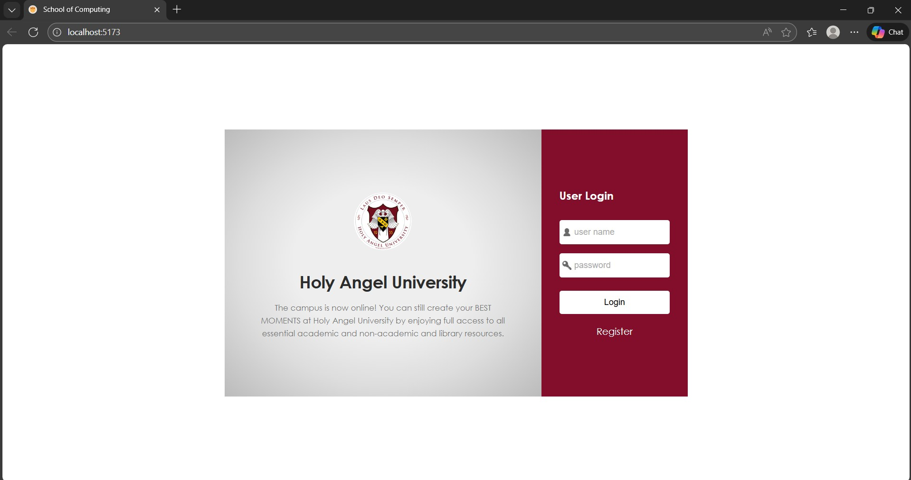
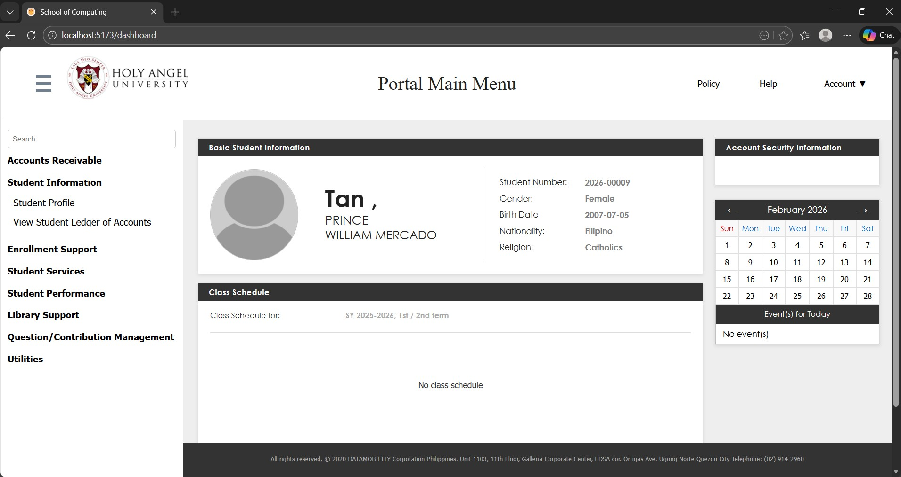
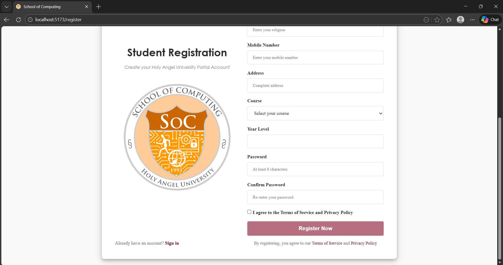

# Vue 3 + Vite
## Campus ++ HAU
<p align="center">
  
</p>

<p align="center">
  
</p>

<p align="center">
  
</p>

## Installation Guide

### Prerequisites
- Node.js (v16 or higher)
- MongoDB (running locally or with connection string)
- Git
- npm or yarn

### Backend Setup

1. **Navigate to backend directory**
   ```bash
   cd backend
   ```

2. **Install dependencies**
   ```bash
   npm install
   ```

3. **Create environment configuration**
   - Create a `.env` file in the backend folder
   - Add your MongoDB connection string and other configurations:
   ```
   MONGODB_URI=mongodb://localhost:27017/hau-portal
   PORT=5000
   JWT_SECRET=your_secret_key_here
   ```

4. **Start the backend server**
   ```bash
   npm start
   # or for development with auto-reload
   npm run dev
   ```
   - Server will run on `http://localhost:5000`

### Frontend Setup

1. **Navigate to frontend directory**
   ```bash
   cd frontend
   ```

2. **Install dependencies**
   ```bash
   npm install
   ```

3. **Create environment configuration**
   - Create a `.env.local` file in the frontend folder:
   ```
   VITE_API_URL=http://localhost:5000
   VITE_REGISTER_PATH=/api/auth/register
   ```

4. **Start the development server**
   ```bash
   npm run dev
   ```
   - Application will run on `http://localhost:5173`

### Running the Full Stack

1. **Start MongoDB** (if running locally)
   ```bash
   mongod
   ```

2. **Start Backend** (in separate terminal)
   ```bash
   cd backend
   npm start
   ```

3. **Start Frontend** (in another separate terminal)
   ```bash
   cd frontend
   npm run dev
   ```

4. **Access the application**
   - Open your browser and navigate to `http://localhost:5173`

### Building for Production

**Frontend Build**
```bash
cd frontend
npm run build
```

**Backend Deployment**
```bash
cd backend
npm install --production
npm start
```

This template should help get you started developing with Vue 3 in Vite. The template uses Vue 3 `<script setup>` SFCs, check out the [script setup docs](https://v3.vuejs.org/api/sfc-script-setup.html#sfc-script-setup) to learn more.

Learn more about IDE Support for Vue in the [Vue Docs Scaling up Guide](https://vuejs.org/guide/scaling-up/tooling.html#ide-support).

Disclaimer this is a personal project only.
